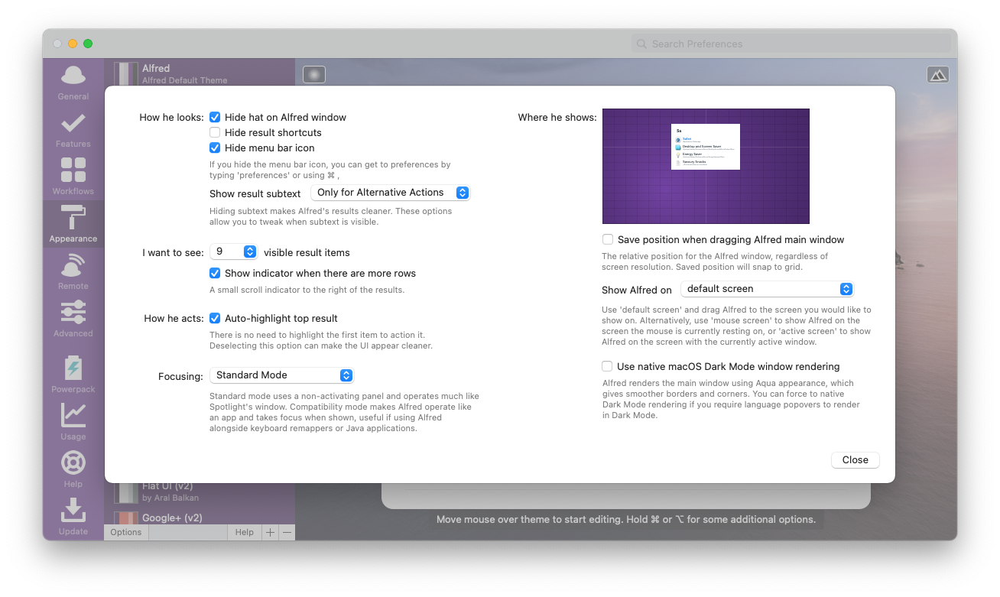

# Dropbox Paper Powerpack Themes

Here are two [Alfred Powerpack Themes](https://www.alfredapp.com/help/appearance/) that are based on [Dropbox Paper](https://paper.dropbox.com)'s color schemes.

There are four variants in all: one light and one dark theme that each use Atlas Grotesk (Dropbox's official typeface); one light and one dark theme that each use Noto Sans, a free alternative.

[Discuss on Alfred Forum](https://www.alfredforum.com/topic/15830-dropbox-paper-inspired-themes/).

  <a href="https://github.com/chrismessina/alfred-theme-dropbox-paper/raw/main/dropbox-paper-themes.zip" class="button">
    Download Themes
  </a>

## Installation

Download the zip file above, unzip it, and then double-click each `.alfredappearance` file to install it.

## Previews

I recommend using Tomoyuki Kashiro's [Dropbox Paper Finder Workflow](https://github.com/tomoyukikashiro/dropbox-paper-alfred-workflow), which I [forked](https://github.com/chrismessina/dropbox-paper-alfred-workflow) to use the Dropbox Paper icon, and that you can see in action here:

### Dropbox Atlas (Light)

This variant uses [Atlas Grotesk](https://commercialtype.com/catalog/atlas/atlas_grotesk) and is available from [Commercial Type](https://commercialtype.com).

  <a href="https://github.com/chrismessina/alfred-theme-dropbox-paper/raw/main/dropbox-atlas-light.zip" class="button">
    Download Theme
  </a>

### Dropbox Atlas (Dark)

This variant uses [Atlas Grotesk](https://commercialtype.com/catalog/atlas/atlas_grotesk) and is available from [Commercial Type](https://commercialtype.com).

  <a href="https://github.com/chrismessina/alfred-theme-dropbox-paper/raw/main/dropbox-atlas-dark.zip" class="button">
    Download Theme
  </a>

### Dropbox Noto (Light)

This variant uses [Noto Sans](https://fonts.google.com/specimen/Noto+Sans) which is freely downloadable from Google Fonts. [Download it here](https://fonts.google.com/download?family=Noto%20Sans).

  <a href="https://github.com/chrismessina/alfred-theme-dropbox-paper/raw/main/dropbox-noto-light.zip" class="button">
    Download Theme
  </a>

### Dropbox Noto (Dark)

This variant uses [Noto Sans](https://fonts.google.com/specimen/Noto+Sans) which is freely downloadable from Google Fonts. [Download it here](https://fonts.google.com/download?family=Noto%20Sans).

  <a href="https://github.com/chrismessina/alfred-theme-dropbox-paper/raw/main/dropbox-noto-dark.zip" class="button">
    Download Theme
  </a>

## Suggested configuration

Disable the Alfred hat logo by unchecking: `Alfred Preferences › Appearance › Options › Hide hat on Alfred window`

Disable result shortcuts by unchecking: : `Alfred Preferences › Appearance › Options › Hide result shortcuts`

Simplify results by switching the result subtext to "Only for Alternative Actions".

## About

This theme is unaffiliated with nor endorsed by Dropbox.

<a href="https://www.alfredforum.com/topic/15830-dropbox-paper-inspired-themes/">Alfred Forum link</a>.
